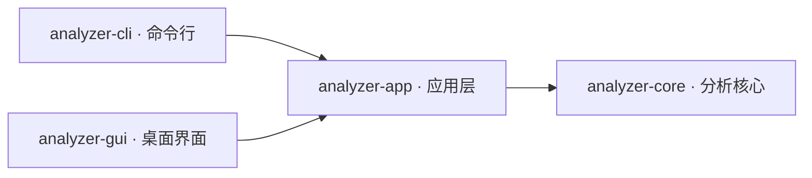
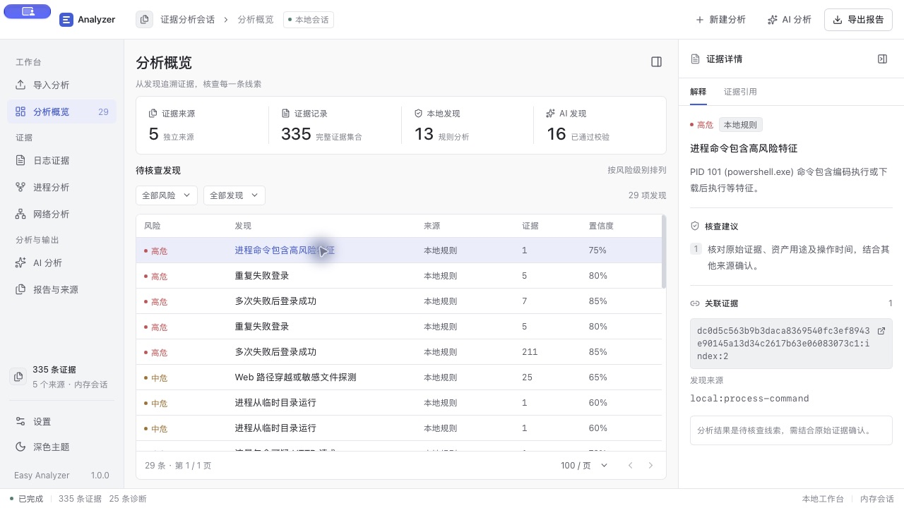
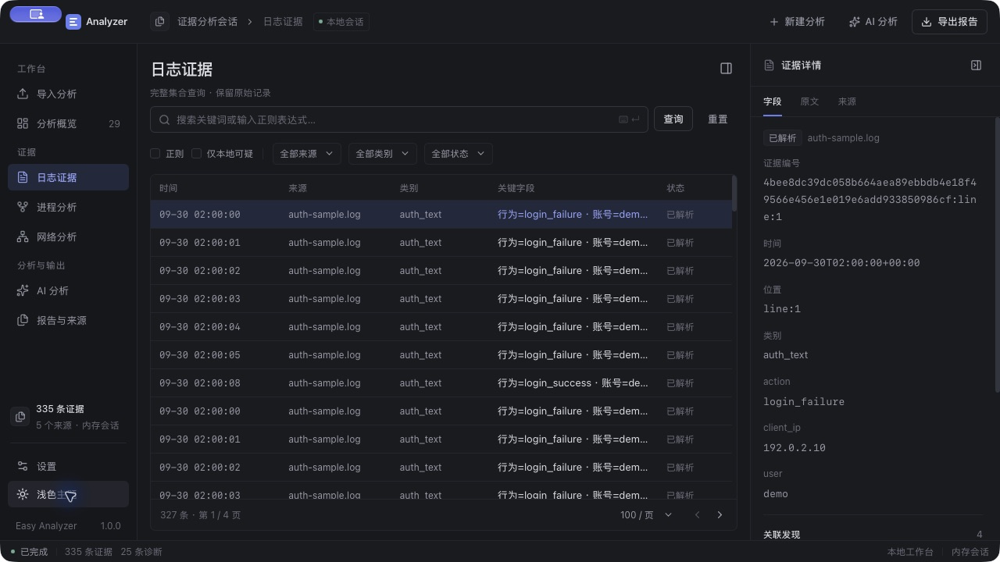

# Easy Analyzer

Rust 开发的应急响应分析工具，提供 CLI 和桌面 GUI，用于日志、进程与离线网络证据分析。

- **日志**：Windows EVTX、Linux 登录/SSH 日志、Apache/Nginx 日志，支持本地规则、关键词和正则筛选。
- **进程与流量**：采集本机进程或导入快照，查看进程树；导入 PCAP/PCAPNG，分析网络会话及 HTTP/DNS/TLS 元数据。
- **AI 与报告**：接入 OpenAI 兼容服务，按证据范围分析；导出包含完整证据的 HTML/JSON 报告。
- **应急响应项目**：每次响应独立保存为 `.eair`，记录客户单位、响应时间及服务资料，多天追加证据、保留 AI 历史和备注。
- **IOC 匹配**：文件、粘贴及手动输入 IPv4/IPv6、域名、HTTP/HTTPS URL，离线扫描项目，查看命中位置并跳转证据。

## CLI

适合终端操作、批量分析和脚本集成。支持多文件混合导入、标准输入、风险摘要和进程树。

```sh
# 筛查可疑日志
./easy-analyzer logs cases/Security.evtx -s

# 查看本机进程树
./easy-analyzer processes -t

# 分析抓包并导出报告
./easy-analyzer pcap cases/capture.pcapng -H reports/network.html

# 查看完整命令与参数
./easy-analyzer -h

# 新建项目并追加证据，手动保存
./easy-analyzer project create response.eair --name "客户甲应急响应" --client "客户甲"
./easy-analyzer project import response.eair host-a/auth.log capture.pcap --ioc indicators.csv
./easy-analyzer project open response.eair -H reports/response.html
./easy-analyzer project list --search "客户甲"

# 直接分析并保存新项目；IOC 参数可以重复
./easy-analyzer analyze auth.log --save-project response-new.eair \
  --name "客户乙应急响应" --client "客户乙" --ioc-value example.com --ioc indicators.txt
```

启用 AI 时，先运行 `./easy-analyzer config init`，在 `config.toml` 中填写服务地址、模型和密钥，再添加 `-a`；`-S suspicious` 可限定为本地可疑项。

## GUI

基于 Tauri 2、React 和 TypeScript，提供浅色/深色主题。

- 拖入或选择文件，在概览、日志、进程和网络页面浏览分析结果。
- 首页搜索、继续或新建应急响应项目；工作台显示项目与客户，支持手动保存、另存为及未保存提示。
- 向当前项目追加证据，在详情中保存备注；IOC 清单支持混合追加、说明编辑和主动扫描。
- 全集合筛选、分页查看和证据引用跳转，按需展开原始记录。
- AI 发送前预览范围和预算，支持后台分析、进度展示和取消。
- 在设置页管理 AI 配置，一键导出完整报告。

默认在本地分析；AI 仅在主动启用后发送证据，数据不会自动脱敏。PCAP 默认发送解析摘要，原始包与载荷需额外选择。项目使用内置 SQLite，操作位于私有工作数据库，手动保存生成独立 `.eair` 快照；文件移至另一台机器后可直接续办，无需原始输入或数据库服务。项目目录只保存资料和路径，不汇总客户证据。项目不保存 AI 密钥。

TXT 每行一个 IOC；CSV 使用 `type,value` 和可选 `note`（类型为 `ip`、`domain`、`url`）。域名默认包含子域名，CLI 用 `--ioc-exact-domain` 切换精确匹配；URL 忽略片段，保留路径和查询差异。追加证据后保留旧命中并提示尚未扫描；取消扫描保留有效命中及覆盖范围。IOC 命中作为待核查线索，不代表确认入侵。完整项目资料、备注和清单保存在数据库中；HTML 显示项目抬头，JSON 沿用原报告 schema。详细格式及性能见 [项目说明](docs/PROJECTS.md)。

## 架构



CLI/GUI 负责交互；app 统一编排分析、会话、筛选、后台任务、配置和导出；core 负责解析、规则、AI 协议和报告编码。两个前端共用同一套分析能力。

## 截图

以下为 2026-10-01 的原生 GUI 截图，使用合成样本；截图版本为 1.0.0，当前界面可能略有调整。

**分析概览 · 浅色主题**



**日志证据 · 深色主题**



## 下载与构建

从 [Releases](https://github.com/MoShouSecurity/easy_analyzer/releases) 下载对应平台的 CLI 或 GUI：Windows x64、Linux x64、macOS ARM64。Linux 程序和 macOS CLI 下载后需 `chmod +x`；macOS GUI 打开 DMG 后，将 `Easy Analyzer.app` 拖入“应用程序”再打开。

Windows GUI 需要 WebView2，Linux GUI 需要 GTK 3 / WebKitGTK 4.1；macOS CLI 要求 11.0+，GUI 要求 13.0+，使用 ad-hoc 签名，未公证。跨平台构建不代表所有桌面交互均已实机验证。macOS 可导入离线日志；本机日志自动加载仅适用于 Windows/Linux。流量分析不支持实时抓包、TCP 重组或 TLS 解密。

源码构建需要 Rust 1.95+ 和平台构建依赖；GUI 另需 Node.js 22.12+。

```sh
# CLI
cargo build --release --locked -p easy-analyzer

# GUI
npm --prefix crates/analyzer-gui/frontend ci
npm --prefix crates/analyzer-gui/frontend run build
cargo run --locked -p analyzer-gui
```

macOS 本地打包：CLI 使用 `bash tools/package-macos.sh`，GUI 使用 `bash scripts/package_gui_macos.sh`。

## 开源协议

本项目采用 [MIT License](LICENSE)。

Copyright (c) 2026 Easy Analyzer contributors
