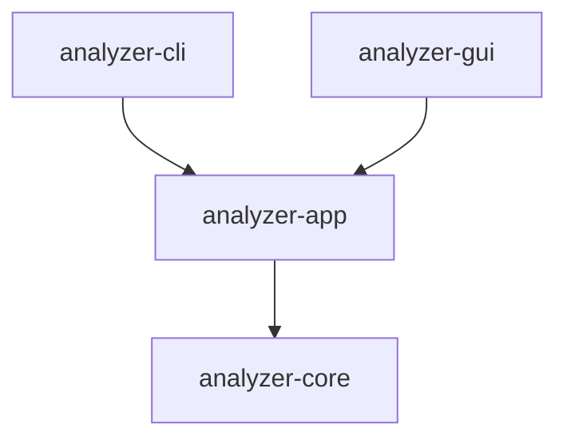

# CLI / GUI 共享架构

## 分层

| 层 | 职责 |
| --- | --- |
| CLI | 参数/帮助、标准输入输出、退出码、Ctrl+C、终端动画 |
| GUI | Tauri 窗口/原生对话框与 IPC；React 控件、主题、分页视图和任务事件展示 |
| app | 场景校验、导入与采集编排、会话、筛选与 AI 范围、后台任务、配置与报告保存 |
| core | 证据模型、格式识别与解析、采集、规则、AI 协议、进程关系、报告编码 |

app/core 不打印终端，不依赖 clap 或 GUI 框架。报告渲染返回字符串；保存结果返回路径，前端自行显示。GUI crate 直接依赖 app，通过 app 导出的模型访问 core 数据；不依赖 CLI。

## 分析与会话

- `AnalysisRequest`：通过 `AnalysisMode` 区分混合、日志、进程、PCAP；输入可以是文件路径或带来源标签的字节。保留 512 MiB/文件、100 万记录/输入的默认限制。
- `AnalysisService::load`：导入和本地规则分析，返回会话。`execute`：再执行请求中的筛选及主动选择的 AI 分析。
- `AnalysisSession`：通过引用计数共享会话，维护不可变记录及证据 ID 索引；AI、活动选择等修改按会话串行提交。只读查询、分页及证据查看可并发执行。
- `query`：返回独立 `RecordSelection`，不修改报告或重新读取文件；`set_selection` 将选择提交为报告的 `query_matches`。可疑筛选使用本地规则证据，查询与可疑筛选同用时取交集。
- `page`：返回摘要和解析字段，分页大小为 1–1000，越界偏移返回空页；不返回原始内容。`record(id)` 按需取得一条完整证据。选择绑定会话，跨会话选择会被拒绝。
- `page_metadata`：GUI 使用的轻量页面，额外省略包载荷；`record(id)` 仍返回完整证据，旧 `page` 行为保持兼容。
- `select_records(RecordFilter)`：在完整集合上取关键词/正则、本地可疑、类型、来源、日志类别、解析状态与协议的交集；保留原有 `QueryOptions`。
- `overview` / `finding_page` / `locate_record`：完整统计、风险/发现来源筛选分页、会话内证据定位。来源与诊断分别通过 `source_page` / `diagnostic_page` 分页。
- `process_rows`：后台生成按来源分组的树行，使用证据 ID 区分跨来源 PID，保留匹配节点的祖先上下文并标记孤儿/循环。上下文祖先不加入 AI 发送范围。`flow_page` 保留完整会话统计并附匹配包数量；`flow_selection` 取关联包与筛选交集。
- `findings` / `flows`：分页读取发现和网络会话。`process_forest`：按来源分组的节点、父子引用、普通根、循环根、孤儿与循环标记；进程引用使用证据 ID，避免跨来源连接同 PID。
- `with_report`：在读取锁内使用完整报告，避免复制全部证据；回调中不能修改同一会话。

记录和原始证据仍存储在内存，不提供案件数据库或磁盘索引。

## AI

`AnalysisService::analyze_ai` 对已加载会话分析，不再次导入或执行规则。`all` 使用全部记录，`matches` 使用显式选择或活动查询，`suspicious` 使用本地规则证据。开始时固定所选记录，之后的独立查询不会改变正在发送的范围。

`analyze_ai_with_config` 接受前端固定的设置快照，保留已有调用方式。GUI 使用新增 `prepare_ai_with_config` 和 `analyze_prepared_ai`：前者按完整选择在后台完成纯本地准备，返回绑定原会话、固定配置及格式化证据的不透明计划，后者在原会话操作锁内执行并提交结果。前端只收到 `AiPlan` 统计和计划标识；范围、载荷、设置、会话或选择标识变化后拒绝旧计划。预览不解析密钥或发送请求，磁盘配置修改不改变已准备的请求。原有配置路径入口供 CLI 使用，保持兼容。

沿用 Chat Completions、场景 system 提示词、96 KiB 默认批次、JSON/证据校验及最多两次格式重试。PCAP 默认只发送摘要，载荷仍需每次主动选择。重复 AI 分析保留各次运行与唯一发现 ID，已有诊断不删除；单次 AI 任务状态描述该次操作，完整 execute 的状态同时包含本地来源失败。

core 负责 `context_tokens` 预算、可取消的本地 token 保守估算、完整记录分批及跨批汇总协议。上下文模式预留输出与 20% 余量，计入提示、消息/schema 与重试开销；没有该字段时保留旧字节分批行为。汇总只接受当前输入的已校验证据编号，使用发现及独立的中性 `context` 线索（留在原始回复中，不直接列为异常）；必要时最多四轮归并。`AiRun`/`AiBatch` 沿用原报告 schema 记录每次请求阶段及原始回复，不重复累计分析记录数，汇总不删除初始有效发现。证据批次失败继续分析其余批次并汇总成功回复，汇总输入标明覆盖范围；汇总分组失败继续处理其他分组，失败分组的已校验输入仍保留到后续轮次。整轮无成功回复停止进一步汇总。core 输出可选的临时 `AiAnalysis.local_summary`，app 存为既有诊断（`AI 本地整理`、`ai-run:N`），GUI 在运行摘要 DTO 中投影，不增加报告字段或伪造发现；完整原始回复和错误保留。AI 请求进度显示证据阶段或每轮汇总的当前批次与该阶段总批次；汇总轮数和全任务最终请求总量不能预知，因此不据此展示完成百分比。准备阶段的未知总量仍用 `None` 表达。

## 执行控制与后台任务

core 的 `ExecutionContext` 包含 `CancellationToken` 和线程安全的进度回调，覆盖读取、哈希、解析、采集、规则、查询、会话聚合与 AI。数量按阶段分别表示字节、记录或批次；不确定总量时为 None。回调在工作线程执行，应只投递事件或更新轻量状态，不能修改正在执行的同一会话。

旧 core 函数保留，新 `*_with_context` 入口接受执行控制。兼容入口使用默认上下文。

- `task::spawn_analysis` / `spawn_query` / `spawn_ai`：在独立系统线程运行，返回 `TaskHandle`，无需前端提供异步运行时。
- `task::spawn_operation` 可复用同一任务通道执行导出、设置检查等操作，操作自行检查执行上下文。
- 每个事件带任务 ID，状态为 Running、Cancelling、Completed、Partial、Cancelled、Failed；每个任务产生一个终止事件。
- GUI 事件循环使用 `events.try_recv()` 和 `try_result()`，结果只能取出一次；`wait()` 为阻塞接口，适合 CLI/工作线程，不能在 GUI 主线程等待。
- 同一会话的修改串行执行；等待修改锁的任务也能取消。关闭或替换案件时请求取消，并按任务 ID 丢弃旧界面的事件。

取消为协作式：读取块和耗时循环检查令牌，阻止后续采集、AI 重试及批次。原生采集调用和已经发送的 HTTP 请求等待当前调用返回或超时。当前 HTTP 回复依然校验并保存，未通过校验的回复不成为结论。

读取/哈希尚未完整完成时不建立完整来源；取得完整哈希后取消解析，可以保留已解析记录，诊断明确该来源未处理完。取消不伪装为完成，不改变 `AnalysisReport` schema。

## 配置与报告

`ConfigService` 提供创建、加载、校验后原子保存、脱敏展示和连接检查。默认路径是当前工作目录的 `config.toml`；Unix 保存权限为 0600，保存失败不截断原文件。连接检查需要主动调用。

GUI 使用用户应用数据目录中的配置路径，可选择已有 CLI 配置。偏好只保存主题、详情宽度/开关、配置路径及 窗口尺寸；不持久化前端输入控件内存、证据、会话或密钥。密钥只在主动保存的配置文件中持久化。

`ExportPlan::validate_inputs` 在执行前检查输入、格式定义和配置路径；`save` 再检查实际采集来源。相同输出路径或覆盖证据/配置会被拒绝。text/json 主输出无路径时返回给前端，HTML 无路径时自动保存，已有文件时另取名称。导出不受分页或 CLI `-n` 裁剪。

CLI 完成返回 0，部分失败/取消/失败返回 1；Ctrl+C 只设置取消令牌，之后尝试保存报告。CLI 动画只写入交互式标准错误。

## 验证与发布

使用合成样本和本机模拟 AI 服务验证接口、兼容输出、任务、取消和配置；详见 [应用层验证记录](VALIDATION.md)及 [GUI 验证记录](GUI_VALIDATION.md)。GUI 主线程通过 `try_recv` / `try_result` 读取结果，以会话 ID 和视图修订号忽略过期读取。修改任务与导出按序运行，AI 期间可以继续分页浏览。

普通源码更新不创建发布标签、不触发 Actions。只有明确要求“打包成 tag”时，才按现有发布策略构建和发布程序及 SHA256SUMS。

## Tauri 通信边界

`analyzer-gui/src/model.rs` 定义 Rust DTO，前端对应 `frontend/src/types.ts`。命令返回当前页、来源/诊断/运行历史分页及选择标识，不传输完整报告。证据详情和 AI 原始回复按需读取；数据包列表不含原始载荷。前端没有文件系统、HTTP 或 AI 插件权限，只能调用受控 Rust 命令。配置只返回密钥状态，新增/清除密钥是显式操作。

`get_view` 在后台构造完整筛选集合，将选择保存在 Rust 端。查询失败不会替换有效选择；来源、类别、状态、协议及本地可疑项均作用于完整集合。证据引用可临时展示筛选外目标，返回恢复原页面、筛选、页码和选中项；上下文祖先与临时证据不会扩大 AI 范围。

任务事件携带任务 ID、会话 ID、会话代次和视图修订号，进度最多每 100ms 投递，最终状态在提交有效结果后立即发送。读取在后台执行，并以会话 ID、递增修订号和取消令牌隔离旧结果。同一 GUI 内只允许一个写任务，AI 时可继续查询。AI 范围、设置和载荷选择在启动时固定。

Tauri 采用系统 WebView；默认仅加载嵌入静态资源，证据、建议及原始回复以 React 文本显示，CSP 禁止外部脚本与前端网络请求。开发时使用 Vite 本机预览，实际功能验收在原生窗口执行。
