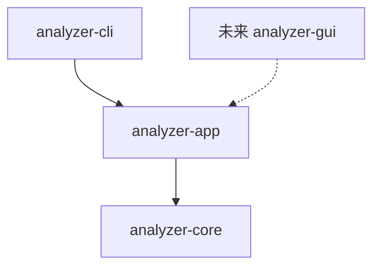

# CLI / GUI 共享架构

## 分层

| 层 | 职责 |
| --- | --- |
| CLI | 参数/帮助、标准输入输出、退出码、Ctrl+C、终端动画 |
| app | 场景校验、导入与采集编排、会话、筛选与 AI 范围、后台任务、配置与报告保存 |
| core | 证据模型、格式识别与解析、采集、规则、AI 协议、进程关系、报告编码 |

app/core 不打印终端，不依赖 clap 或 GUI 框架。报告渲染返回字符串；保存结果返回路径，前端自行显示。GUI 尚未创建，后续新增 GUI crate 直接依赖 app。

## 分析与会话

- `AnalysisRequest`：通过 `AnalysisMode` 区分混合、日志、进程、PCAP；输入可以是文件路径或带来源标签的字节。保留 512 MiB/文件、100 万记录/输入的默认限制。
- `AnalysisService::load`：导入和本地规则分析，返回会话。`execute`：再执行请求中的筛选及主动选择的 AI 分析。
- `AnalysisSession`：通过引用计数共享会话，维护不可变记录及证据 ID 索引；AI、活动选择等修改按会话串行提交。只读查询、分页及证据查看可并发执行。
- `query`：返回独立 `RecordSelection`，不修改报告或重新读取文件；`set_selection` 将选择提交为报告的 `query_matches`。可疑筛选使用本地规则证据，查询与可疑筛选同用时取交集。
- `page`：返回摘要和解析字段，分页大小为 1–1000，越界偏移返回空页；不返回原始内容。`record(id)` 按需取得一条完整证据。选择绑定会话，跨会话选择会被拒绝。
- `findings` / `flows`：分页读取发现和网络会话。`process_forest`：按来源分组的节点、父子引用、普通根、循环根、孤儿与循环标记；进程引用使用证据 ID，避免跨来源连接同 PID。
- `with_report`：在读取锁内使用完整报告，避免复制全部证据；回调中不能修改同一会话。

记录和原始证据仍存储在内存，不提供案件数据库或磁盘索引。

## AI

`AnalysisService::analyze_ai` 对已加载会话分析，不再次导入或执行规则。`all` 使用全部记录，`matches` 使用显式选择或活动查询，`suspicious` 使用本地规则证据。开始时固定所选记录，之后的独立查询不会改变正在发送的范围。

沿用 Chat Completions、场景 system 提示词、96 KiB 默认批次、JSON/证据校验及最多两次格式重试。PCAP 默认只发送摘要，载荷仍需每次主动选择。重复 AI 分析保留各次运行与唯一发现 ID，已有诊断不删除；单次 AI 任务状态描述该次操作，完整 execute 的状态同时包含本地来源失败。

## 执行控制与后台任务

core 的 `ExecutionContext` 包含 `CancellationToken` 和线程安全的进度回调，覆盖读取、哈希、解析、采集、规则、查询、会话聚合与 AI。数量按阶段分别表示字节、记录或批次；不确定总量时为 None。回调在工作线程执行，应只投递事件或更新轻量状态，不能修改正在执行的同一会话。

旧 core 函数保留，新 `*_with_context` 入口接受执行控制。兼容入口使用默认上下文。

- `task::spawn_analysis` / `spawn_query` / `spawn_ai`：在独立系统线程运行，返回 `TaskHandle`，无需前端提供异步运行时。
- `task::spawn_operation` 可复用同一任务通道执行导出、设置检查等操作，操作自行检查执行上下文。
- 每个事件带任务 ID，状态为 Running、Cancelling、Completed、Partial、Cancelled、Failed；每个任务产生一个终止事件。
- GUI 事件循环使用 `events.try_recv()` 和 `try_result()`，结果只能取出一次；`wait()` 为阻塞接口，适合 CLI/工作线程，不能在 GUI 主线程等待。
- 同一会话的修改串行执行；等待修改锁的任务也能取消。关闭或替换案件时请求取消，并按任务 ID 丢弃旧界面的事件。

取消为协作式：读取块和耗时循环检查令牌，阻止后续采集、AI 重试及批次。原生采集调用和已经发送的 HTTP 请求等待当前调用返回或超时。当前 HTTP 回复依然校验并保存，未通过校验的回复不成为结论。

读取/哈希尚未完整完成时不建立完整来源；取得完整哈希后取消解析，可以保留已解析记录，诊断明确该来源未处理完。取消不伪装为完成，不改变 `AnalysisReport` schema。

## 配置与报告

`ConfigService` 提供创建、加载、校验后原子保存、脱敏展示和连接检查。默认路径是当前工作目录的 `config.toml`；Unix 保存权限为 0600，保存失败不截断原文件。连接检查需要主动调用。

`ExportPlan::validate_inputs` 在执行前检查输入、格式定义和配置路径；`save` 再检查实际采集来源。相同输出路径或覆盖证据/配置会被拒绝。text/json 主输出无路径时返回给前端，HTML 无路径时自动保存，已有文件时另取名称。导出不受分页或 CLI `-n` 裁剪。

CLI 完成返回 0，部分失败/取消/失败返回 1；Ctrl+C 只设置取消令牌，之后尝试保存报告。CLI 动画只写入交互式标准错误。

## 验证与发布

使用合成样本和本机模拟 AI 服务验证接口、兼容输出、任务、取消和配置；详见 [验证记录](VALIDATION.md)。GUI 框架和界面开发独立进行。

普通源码更新不创建发布标签、不触发 Actions。只有明确要求“打包成 tag”时，才按现有发布策略构建和发布程序及 SHA256SUMS。
